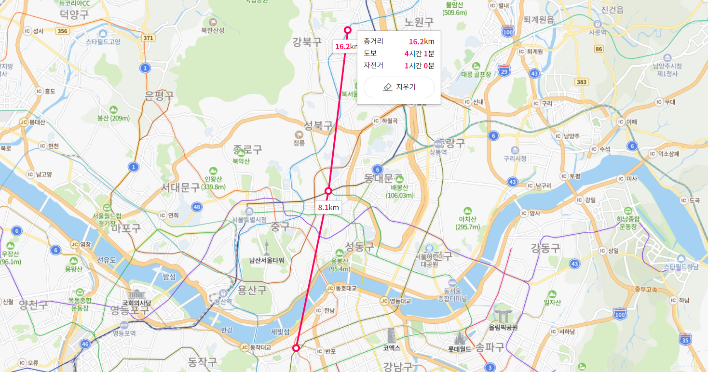

# 장소 추천 프로젝트

> 2020.10.30 ~ 2020.11.2
>
> 2021.09.14 ~2020.09.20 코드 보완 및 수정

<br>

**🧸 주제**

**🧸 분석 목표**

- 언제 어디에서 만날지에 대한 고민을 도울 수 있는 프로그램
- \- 팀 프로젝트 주제를 위해 만날 장소를 정하던 중 어려움을 겪게 되었다 - 우리처럼 어디서 만날지에 대한 고민을 해결하는 것을 목표로 프로젝트를 진행하였다 - 두 지하철 역의 중간역을 알려주고 중간역의 핫플레이스를 만남의 목적에 맞게 추천해주는 프로젝트

<br>

**🧸 결과 요약**

<br>

| 목차                                           | 내용                                                         |
| ---------------------------------------------- | ------------------------------------------------------------ |
| [1. 데이터 정의 및 처리](#1.-EDA)              | 데이터 수집과 전처리                                         |
| [2. 중간 역 찾기](#2.-Market-Basket-Analysis)  | 두 개의 역을 입력받아 거리 계산을 통해 중간 지점에 해당하는 지하철 역을 출력 |
| [3. 중간 역의 핫플레이스 추천](#3.-Regression) | 만남의 목적을 입력 받아 해당 중간 지점 역의 핫플레이스 제공  |
| [4. 중간 역의 혼잡도 예측](#4.-Decision-Tree)  | 시간대와 주말 여부를 입력받아 해당 시간대 중간 지점 역의  승객수와 혼잡도 예측 |
| 5. 결론 및 예시                                |                                                              |

[📝 노트북 보러가기](https://github.com/chenni0531/data-bakery-transaction/blob/master/1-bakery-transaction-eda.ipynb)

<br>

---

<br>

## 1. 데이터 정의 및 처리

| 데이터                         | 출처                    | 설명                                                         |
| ------------------------------ | ----------------------- | ------------------------------------------------------------ |
| 지하철역 주소 데이터           | 서울교통공사            | 1 ~9호선 역 중, 서울에 소재하고있는 318개의 역 주소 수집     |
| 지하철 역 별 핫플레이스 데이터 | 네이버 지도             | 데이트, 팀플, 술로 테마를 구분하고 각 테마별로 추천 장소 3곳씩, 한 지하철 역 당 총 9개의 핫플레이스를 선정 |
| 서울지하철 승,하차 데이터      | 서울시 열린 데이터 광장 | 시간대 별 지하철 역의 승하차 승객 수로 혼잡도 계산           |

<details>
<summary>지하철역 주소 데이터</summary>
<div markdown="1">       
<br>주소를 이용해 위도, 경도로 변환하였으며 환승역이 존재하는 경우 중복을 제거해주었다.
</div>
</details>

<details>
<summary>지하철 역 별 핫플레이스 데이터</summary>
<div markdown="1">       
<br>네이버 지도 기반으로 지하철 역 근방의 핫플레이스를 선정하여 수집하였다.<br><br>
  - 데이트 : 식당, 카페, 놀거리<br>
  - 팀플 : 프랜차이즈 카페<br>
  - 술약속 : 술집
</div>
</details>

<details>
<summary>서울지하철 승,하차 데이터</summary>
<div markdown="1">       
<br>주역 내에 존재하는 인원은 하차 인원수라고 판단했으므로 하차 인원수만 활용하였고 2시간 간격으로 인원 수를 합쳤다.<br><br>
  - 여유 : 2000명 이하<br>
  - 보통 : 2001~3000 명<br>
  - 혼잡 : 3001명 이상
</div>
</details>

<br>

## 2. 중간 역 찾기

**중간 좌표에 해당하는 지하철 역 찾기**

두 지하철 역을 입력 받으면 해당 역의 위도와 경도 좌표로 중간 좌표를 찾는다. 중간 좌표와 가장 가까운 지하철 역을 찾는 과정에서 318개의 지하철 역과의 거리 계산을 진행했다. 이런 경우, 속도 및 성능이 현저히 낮아지는 문제가 발생하여 후보 역을 추리는 방법을 사용했다. 중간 좌표의 위도와 소수점 3자리까지 같은 지하철 역들을 후보 역으로 뽑고 그 중에서 유사한 방법으로 경도 비교를 하여 최종 후보 역을 추렸다.  후보 역들과 중간 좌표와의 거리 계산을 통해 중간 좌표에 해당하는 지하철 역을 찾았다. 거리 계산은 유클라디안 거리 계산 함수를 만들어 사용했다.

**➕ 수정 및 보완 부분**

- 문제: 기존의 비슷한 위도를 찾고 그 중에서 비슷한 경도를 찾는 방식에서 소수점 자리 3자리 기준으로 위도가 같은 역들을 후보로 뽑았다. 하지만 소수점 3자리까지 같은 역이 없다면 후보 역 자체가 아예 뽑히지 않는 문제가 발생한다.

- 해결: 중간 좌표의 위도와 모든 지하철 역의 위도의 차를 기준으로 차이가 가장 작은 5개의 후보 역을 추리고 이들과의 거리 계산을 통해 중간 좌표와 가까운, 중간 지하철 역을 찾았다. 



<br>

## 3. 중간 역의 핫플레이스 추천

네이버 지도 데이터를 활용하여 해당 중간 역 근처의 핫플레이스를 추천할 수 있도록 하였다. 만남의 목적을 입력 받으면 목적에 맞게 식당, 카페, 놀거리 등을 제공한다. 장소 확인의 편의를 위해 해당 핫플레이스의 위치를 표시한 지도를 함께 출력하였다.

| 만남의 목적              | 추천 장소 구분     |
| ------------------------ | ------------------ |
| 눈누난나 데이트 (데이트) | 식당, 카페, 놀거리 |
| 모여라 취해보자 (술모임) | 식당 (술집)        |
| 마밀라피나타파이 (팀플)  | 프랜차이즈 카페    |

|  |  |
| ------------------------------------ | ------------------------------------ |

|
|

<br>

## 4. 중간 역의 혼잡도 예측

**중간 역의 승객수 예측**

```
설명변수: time(시간대), subname(지하철 역명), dayweek(평일/주말)
목표변수: passenger(승객 수)
```

회귀분석을 통해 승객 수를 예측하였다. 체감 혼잡도에 영향을 주는 인원은 역사 내 존재할 것으로 예상되는 하차 승객 수라고 판단하여 하차 승객 수만을 활용하였다.

```
R2 : 0.8818352689926695  
MSE : 119420.69160759673
```

 **중간 역의 혼잡도 예측**

| 분류 기준      | 분류               |
| -------------- | ------------------ |
| 승객 수 < 2000 | 식당, 카페, 놀거리 |
| 승객 수 < 2000 | 식당 (술집)        |
| 승객 수 < 2000 | 프랜차이즈 카페    |

```
설명변수: time(시간대), subname(지하철 역명)
목표변수: con(혼잡도)
```


**➕ 수정 및 보완 부분**

승차 인원을 예측할 때

변수로 시간대, 지하철역, 평일/주말 여부를 받아서

종속 변수로 승객 수를 도출하도록 회귀 식을 작성하였는데

이는 예측이 아니라 단순 계산

지하철 수요에 영향을 미치는 여러 요인은 크게 역 관련 정보(지하철 운영일, 호선, 노선개수, 출구 개수, 위도, 경도 등), 역 주변 정보(역 주변 버스정류장 수, 백화점 수, 영화관 수, 500m 내 용도 지역 등), 역의 행정동 별 정보(인구 수, 종사자 수, 사업체 수 등), 날씨 정보 

(변수 선정은 논문 결과를 활용하였다 [출처](https://scienceon.kisti.re.kr/commons/util/originalView.do?cn=JAKO201912964890855&oCn=JAKO201912964890855&dbt=JAKO&journal=NJOU00025585))


```
설명변수: time(시간대), subname(지하철 역명), dayweek(평일/주말), gate_num(출구 수), fac_num(주요 시설 수)
목표변수: passenger(승객수)
```


0 여유, 1 보통, 2 혼잡

설명 변수: 노선 개수, 호선, 역 주변 시설 개수, 주말여부, 시간대

목표 변수: 승객수

<br>

## 5. 결론 및 활용 예시


**🧸 프로젝트를 마치며**

알고리즘의 개념정도만 익히고 바로 진행했던 프로젝트여서 

모델에 대한 정확한 이해 없이 적용했던 부분들이 눈에 띄었다. 그 부분들을 보완해서 정리했다.


지도 API를 활용할 생각을 하지 못하고 하나씩 손 크롤링.. 했었는데 


**🧸 한계점 및 발전 방향**

거리로 측정했기 때문에 그것이 도보인지 차도인지 혹은 건물이 잇는 곳인지 알 수 없다.

따라서 대중 교통을 이용하거나 그런 경우에는 조금 달라질 수 있을 것 같다


예측 데이터를 어떻게 해야할지 고민하는 과정에서 시간이 많이 걸렸다

시간대를 어떻게 변수로 잡아야할지 시간대 하나하나를 변수로 잡을지,

그러고 데이터가 횡단형으로 되어어있어서 전러리 하는 과정도 꽤 걸렸다..


처음에 정확도가 10%도 안되었음

정규화, 로그변환


원핫 인코딩 -> dummies 데이터


내 생각에는 중복되는 변수 값들이 많았기 때문?

평균값을 많이 사용했고 지하철 출구 개수 및 시설물 개수의 경우 결측값이 많아 평균값을 사용했기 떄문


사실 정확한 승객 수보다는 해당 승객수로 인한 혼잡도 -> KNN

정확한 예측값을 알 필요는 없으므로 


----------------------------------


R2 : 0.887096494268603  MSE : 0.1056309546962976

subname을 더미데이터로 하니까 정확도가 높아졌다


이전에도 설명력이 꽤 높았으나 다중공선성으로 인한 영향이 있었던 것

차원 축소를 통해서 설명력은 조금 낮아졌지만 공선성을 없앴다


knn

0.993801652892562


모델 설명을 위해

**gate_num**

**fac_num**

유의하지 않았고 

역 자체의 

주말 주중의 역할 큼


서울 지하철 데이터에 대해서는 약간의 필터링 느낌이 있지만

새로운 지하철 데이터를 넣으면 예측 가능


각 역 별 승하차 인원수를 시계열 예측하여 

날짜 별로 승하차 인원수

예측해서 

날짜를 받아서 주중/주말, 인원수 


\- 두 역의 중간 지점 제시 → 어디에서 만날지에 대한 고민 해결 - 해당 중간 역의 핫플 추천 → 어디 갈지에 대한 고민 해결 - 혼잡도 예측을 통해 약속 시간 정할 때 활용 가능 - 일상 가까이에서 겪는 불편함이나 고민을 데이터 관점으로 해결할 수 있었다: 다양한 경로에서 얻은 데이터와 배운 알고리즘 기법을 활용 - 실생활에 활용할 수 있는 실용적인 결과를 얻을 수 있었다 - 분석 목표 > 어떤 결과를 도출할지 > 적합한 분석 방법의 흐름을 생각하며 데이터 분석 계획을 세우고 역할을 분담하는 경험을 할 수 있었다


\- 3명 이상이 될 경우 직선사이의 중점이 아닌 점을 연결한 도형의 중점을 찾는 방법으로 달리 적용해야했다 - 유클리디안 거리계산을 적용할 때 지구의 곡률 등은 고려하지 못해서 약간의 오차가 발생했다
