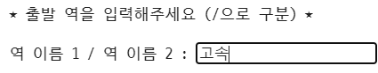
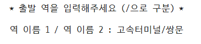
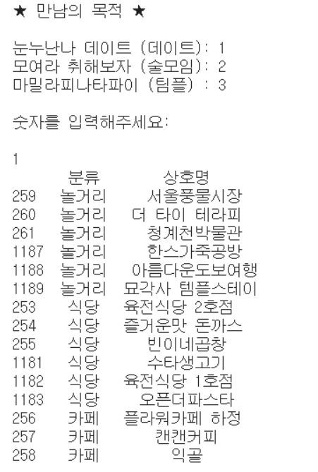
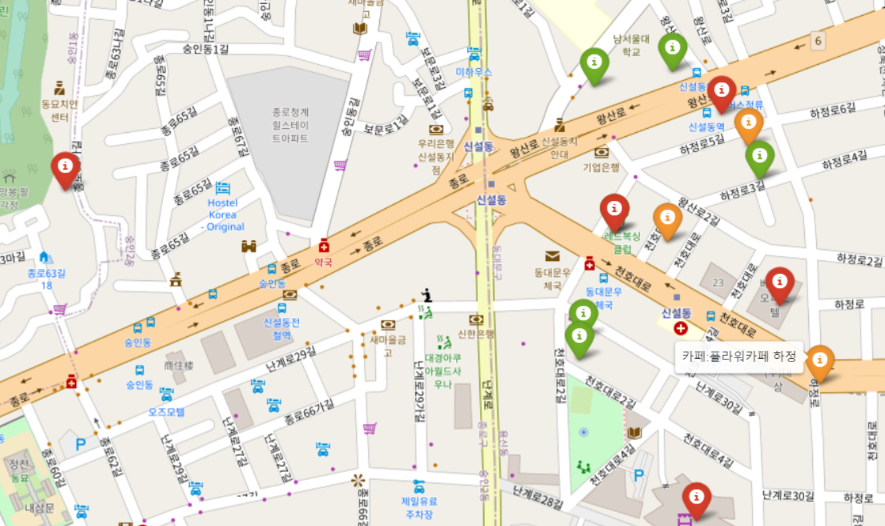
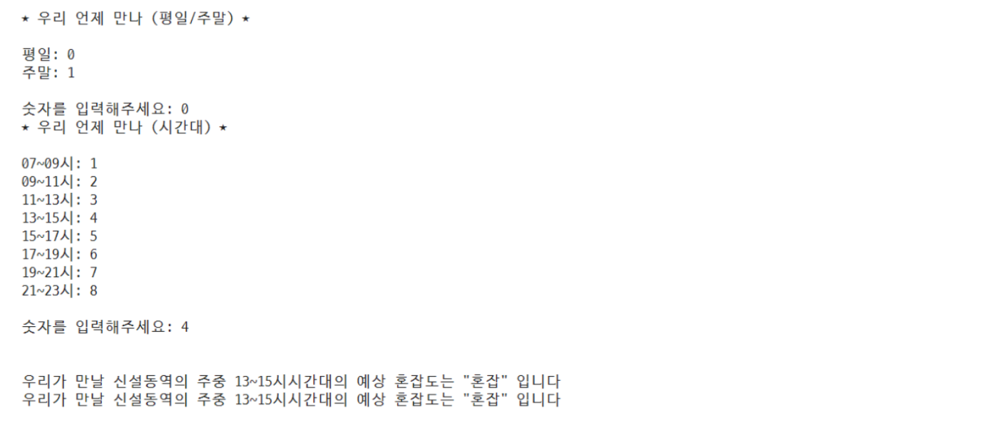
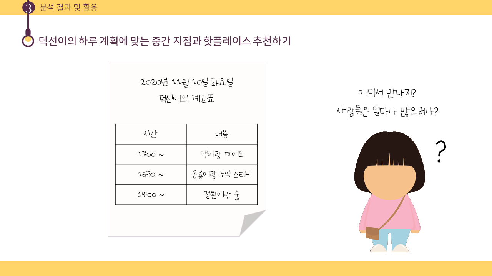
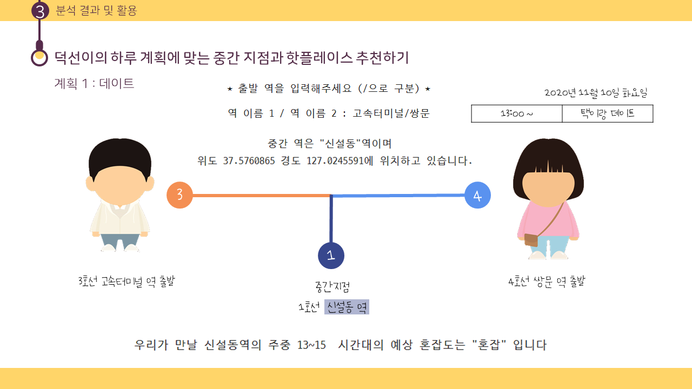
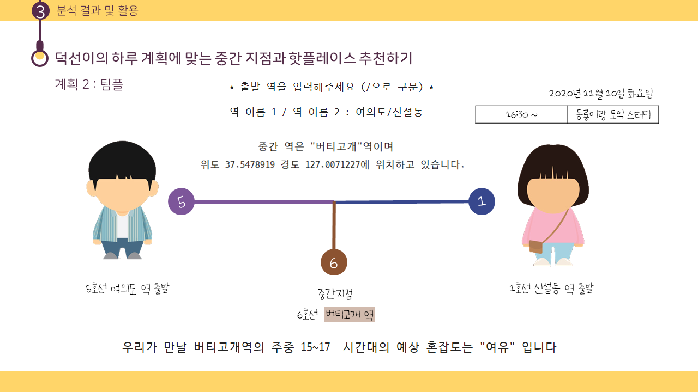
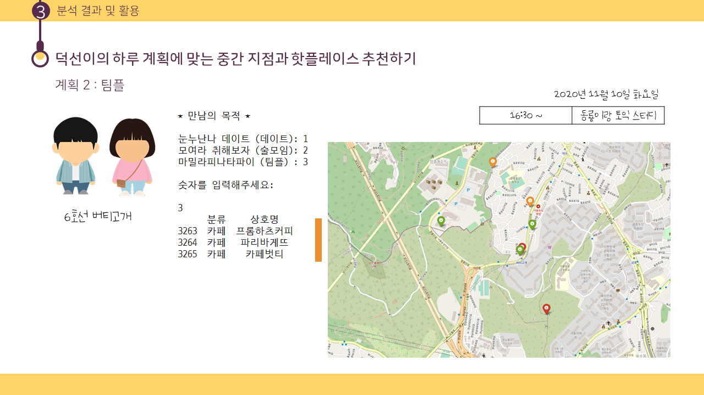
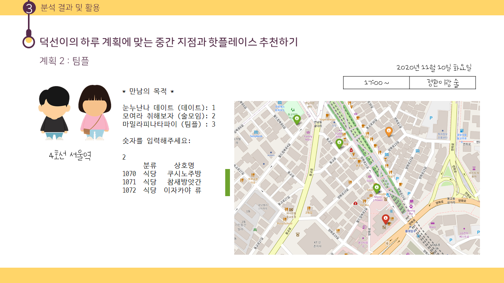

# 장소 추천 프로젝트

> 2020.10.30 ~ 2020.11.2
>
> 2021.09.14 ~2020.09.20 코드 보완 및 수정


<br>

**🧸 주제: 중간 역 및 목적에 따른 핫플레이스 추천과  혼잡도 예측을 통한 만남 정보 제공**

**🧸 분석 목표**: 언제 어디에서 만날지 고민하는 우리를 위해 중간 역과 추천 장소, 혼잡도를 예측하여 제공한다!

- 배경: 팀 프로젝트나 친구들과의 약속 등 만날 장소를 정하는 어려움을 종종 겪었다. 마침 함께 프로젝트를 하게 된 팀원들도 같은 고민을 자주 하였고 이러한 고민에 도움이 될 수 있는 주제를 정하게 되었다. 약속 장소를 정할 때 도움이 될 수 있는 중간 역 정보와 해당 역의 핫 플레이스, 그리고 약속 시간에 참고할 수 있는 시간대 별 혼잡도를 제공하는 프로젝트를 진행하기로 하였다.
- 두 지하철 역의 중간 역을 알려주고 해당 역의 핫플레이스를 만남의 목적에 맞게 추천해주자

<br>

**🧸 결과 요약**

- 두 역의 중간 지점 제시 → 어디에서 만날지에 대한 고민 해결
- 해당 중간 역의 핫플 추천 → 어디에 갈지, 무엇을 할지에 대한 고민 해결 
- 혼잡도 예측 → 약속 시간 정할 때 활용 가능 

<br>

| 목차                                                         | 내용                                                         |
| ------------------------------------------------------------ | ------------------------------------------------------------ |
| [1. 데이터 정의 및 처리](#1.-데이터-정의-및-처리)            | 데이터 수집과 전처리                                         |
| [2. 중간 역 찾기](#2.-중간-역-찾기)                          | 두 개의 역을 입력받아 거리 계산을 통해 중간 지점에 해당하는 지하철 역을 출력 |
| [3. 중간 역의 핫플레이스 추천](#3.-중간-역의-핫플레이스-추천) | 만남의 목적을 입력 받아 해당 중간 지점 역의 핫플레이스 제공  |
| [4. 중간 역의 혼잡도 예측](#4.-중간-역의-혼잡도-예측)        | 시간대와 주말 여부를 입력받아 해당 시간대 중간 지점 역의  승객수와 혼잡도 예측 |
| [5. 결론 및 활용 예시](#5.-결론-및-활용-예시)                | 덕선이의 하루 계획에 맞는 중간 역과 핫플레이스 추천하기      |

[📝 노트북 보러가기](https://github.com/chenni0531/data-bakery-transaction/blob/master/1-bakery-transaction-eda.ipynb)

<br>

---

<br>

## 1. 데이터 정의 및 처리

| 데이터                         | 출처                    | 설명                                                         |
| ------------------------------ | ----------------------- | ------------------------------------------------------------ |
| 지하철역 주소 데이터           | 서울교통공사            | 1 ~9호선 역 중, 서울에 소재하고있는 318개의 역 주소 수집     |
| 지하철 역 별 핫플레이스 데이터 | 네이버 지도             | 데이트, 팀플, 술로 테마를 구분하고 각 테마별로 추천 장소 3곳씩, 한 지하철 역 당 총 9개의 핫플레이스를 선정 |
| 서울지하철 승,하차 데이터      | 서울시 열린 데이터 광장 | 시간대 별 지하철 역의 승하차 승객 수로 혼잡도 계산           |

<details>
<summary>지하철역 주소 데이터</summary>
<div markdown="1">       
<br>주소를 이용해 위도, 경도로 변환하였으며 환승역이 존재하는 경우 중복을 제거해주었다.
</div>
</details>

<details>
<summary>지하철 역 별 핫플레이스 데이터</summary>
<div markdown="1">       
<br>네이버 지도 기반으로 지하철 역 근방의 핫플레이스를 선정하여 수집하였다.<br><br>
  - 데이트 : 식당, 카페, 놀거리<br>
  - 팀플 : 프랜차이즈 카페<br>
  - 술약속 : 술집
</div>
</details>

<details>
<summary>서울지하철 승,하차 데이터</summary>
<div markdown="1">       
<br>주역 내에 존재하는 인원은 하차 인원수라고 판단했으므로 하차 인원수만 활용하였고 2시간 간격으로 인원 수를 합쳤다.<br><br>
  - 여유 : 2000명 이하<br>
  - 보통 : 2001~3000 명<br>
  - 혼잡 : 3001명 이상
</div>
</details>

<br>

## 2. 중간 역 찾기

### 중간 좌표에 해당하는 지하철 역 찾기

두 지하철 역을 입력 받으면 해당 역의 위도와 경도 좌표로 중간 좌표를 찾는다. 중간 좌표와 가장 가까운 지하철 역을 찾는 과정에서 318개의 지하철 역과의 거리 계산을 진행했다. 이런 경우, 속도 및 성능이 현저히 낮아지는 문제가 발생하여 후보 역을 추리는 방법을 사용했다. 중간 좌표의 위도와 소수점 3자리까지 같은 지하철 역들을 후보 역으로 뽑고 그 중에서 유사한 방법으로 경도 비교를 하여 최종 후보 역을 추렸다.  후보 역들과 중간 좌표와의 거리 계산을 통해 중간 좌표에 해당하는 지하철 역을 찾았다. 거리 계산은 유클라디안 거리 계산 함수를 만들어 사용했다.

|  |  |
| ------------------------------------------------------------ | ------------------------------------------------------------ |


<br>

### ➕ 수정 및 보완 부분

- 위도와 경도 기준으로 후보역 추리기 
  - 문제: 기존의 비슷한 위도를 찾고 그 중에서 비슷한 경도를 찾는 방식에서 소수점 자리 3자리 기준으로 위도가 같은 역들을 후보로 뽑았다. 하지만 소수점 3자리까지 같은 역이 없다면 후보 역 자체가 아예 뽑히지 않는 문제가 발생한다.
  - 해결: 중간 좌표의 위도와 모든 지하철 역의 위도의 차를 기준으로 차이가 가장 작은 5개의 후보 역을 추리고 이들과의 거리 계산을 통해 중간 좌표와 가까운, 중간 지하철 역을 찾았다. 


<br>

## 3. 중간 역의 핫플레이스 추천

네이버 지도 데이터를 활용하여 해당 중간 역 근처의 핫플레이스를 추천할 수 있도록 하였다. 만남의 목적을 입력 받으면 목적에 맞게 식당, 카페, 놀거리 등을 제공한다. 장소 확인의 편의를 위해 해당 핫플레이스의 위치를 표시한 지도를 함께 출력하였다.

| 만남의 목적              | 추천 장소 구분     |
| ------------------------ | ------------------ |
| 눈누난나 데이트 (데이트) | 식당, 카페, 놀거리 |
| 모여라 취해보자 (술모임) | 식당 (술집)        |
| 마밀라피나타파이 (팀플)  | 프랜차이즈 카페    |

|  |  |
| ------------------------------------- | ------------------------------------- |

<br>

## 4. 중간 역의 혼잡도 예측

### 4-1. 중간 역의 승객수 예측

회귀분석을 통해 승객 수를 예측하였다. 체감 혼잡도에 영향을 주는 인원은 역사 내 존재할 것으로 예상되는 하차 승객 수라고 판단하여 하차 승객 수만을 활용하였다. 분석의 설명 변수로 사용되는 데이터가 모두 범주형이었기 때문에 `get_dummies`로 가변수를 만들어 사용하였다.

```
설명변수: time(시간대), subname(지하철 역명), dayweek(평일/주말)
목표변수: passenger(승객 수)

R2 : 0.8818352689926695		MSE : 119420.69160759673
```

<br>

### 4-2. 중간 역의 혼잡도 예측

회귀분석으로 예측한 하차 승객 수로 혼잡도를 라벨링하였다.

| 분류 기준              | 분류 |
| ---------------------- | ---- |
| 승객 수 <= 2000        | 여유 |
| 2000 < 승객 수 <= 3000 | 보통 |
| 3000 < 승객 수         | 혼잡 |

```
설명변수: time(시간대), subname(지하철 역명)
목표변수: con(혼잡도)
```



<br>

### ➕ 수정 및 보완 부분

- 승객 수 예측하기

  - 문제: 논문을 살펴보다가 지하철 이용 승객 수에 영향을 줄 수 있는 변수가 꽤 많다는 것을 발견했고 기존에 범주형 데이터만으로 예측을 진행했던 것에 더불어 새로운 데이터를 추가해보고 싶었다. 
  - 해결: 지하철 수요에 영향을 미치는 [여러 요인](https://scienceon.kisti.re.kr/commons/util/originalView.do?cn=JAKO201912964890855&oCn=JAKO201912964890855&dbt=JAKO&journal=NJOU00025585)을 참고하여 이 중 수집할 수 있는 출구 개수, 주요 시설 수 등의 정보를 수치형 변수로 사용하였고 가장 많은 변수가 파생되었던 지하철 역 명 변수는 제외하여 분석을 진행하였다. 하지만 회귀 결과 큰 의미를 갖지는 못하였고 정확도도 10%도 안팎으로 매우 낮은 성능을 보였다. 지하철 출구 개수 및 시설물 개수의 경우 마땅한 데이터를 수집하지 못했는데 이로 인한 결측값 대치에 평균값을 사용하면서 중복되는 값들이 많아졌기 때문이라고 추측된다. 
  - 사실 정확한 승객 수보다는 해당 승객 수로 인한 혼잡도를 예측하는 것이 목적이기 때문에 정확한 승객 수 예측값을 구할 필요는 없었으나 정규화와 로그변환, 지하철 역 명을 변수로 포함시켜 모델 설명력을 높였다. 역 자체가 승객 수에 미치는 영향이 컸으며 추가적으로 주말 주중 여부의 영향도 꽤 크다는 사실을 알아냈다.
  - 반면, VIF 값을 통해 설명력이 꽤 높았던 것은 다중공선성으로 인한 영향이 있었던 것으로 보였다. 차원 축소의 방법과 VIF가 지나치게 큰 변수를 제거하여 공선성을 없애고자 하였으나 이로인한 설명력의 증가 및 MSE 감소 정도가 매우 미미했기 때문에 모든 변수를 모델에 포함시키기로 하였다.
  - 한계: 논문에 나와있는 것처럼 다양한 데이터를 얻는 데에는 약간의 한계가 있었다.

  ```
  설명변수: time(시간대), subname(지하철 역명), dayweek(평일/주말), gate_num(출구 수), fac_num(주요 시설 수)
  목표변수: passenger(승객수)
  
  R2 : 0.887096494268603  	MSE : 0.1056309546962976
  ```


<br>

- 혼잡도 예측하기
  - 문제: 혼잡도 분류 기준을 정해진 수치로 나누다 보니 몇 번의 테스트 결과 통념과는 상이한 결과가 나오는 것을 확인했다. 예를 들어, 주말 저녁 강남의 혼잡도가 여유로 나오는 등 일반적인 생각과는 다른 결과가 나와 코드를 살펴보았고 기준 설정에 문제가 있다고 판단했다. 
  - 해결: 기준은 승객 수 데이터를 삼등분으로 나눈 퍼센티지에 해당하는 수를 사용하기로 했다. 또한, 설명 변수에도 이전에는 시간대와 지하철 역명 변수만 사용되었다면, 승객 수에 많은 영향을 주는 주중 주말 여부를 추가하였고 출구 수, 주요 시설 수 변수도 추가하였다. 그 결과 꽤 높은 분류 정확도를 얻을 수 있었다.

  | 분류 기준                                                    | 분류 |
  | ------------------------------------------------------------ | ---- |
  | 승객 수 < 전체의 33%에 해당하는 수                           | 여유 |
  | 전체의 33%에 해당하는 수 < 승객 수 <= 전체의 66%에 해당하는 수 | 보통 |
  | 전체의 66%에 해당하는 수 < 승객 수                           | 혼잡 |

  ```
  설명변수: time(시간대), subname(지하철 역명), dayweek(평일/주말), gate_num(출구 수), fac_num(주요 시설 수)
  목표변수: con(혼잡도)
  
  accuracy: 0.993801652892562
  ```


<br>

## 5. 결론 및 활용 예시












<br>

<br>

**🧸 프로젝트를 마치며**

- 회귀는 전공 수업 2개에 걸쳐 배울 정도로 친숙한 개념이다. 하지만 공식을 증명하고 정제된 수치로 모델을 적용하고 결과를 해석하는 것과 실제 데이터를 활용하여 원하는 결과를 얻는 것은 꽤나 다른 문제였다. 분석을 직접 진행하면서 회귀 분석 자체에 대한 이해도를 더 넓게 익힌 것 같다. 또한, 회귀 모델의 설명력을 높이기 위한 다양한 방법을 추가적으로 공부하면서 적용해볼 수 있었다.
- 일상 가까이에서 겪는 불편함이나 고민을 데이터 관점으로 해결할 수 있었다. 그 과정에서 분석 목표을 정하고 어떤 결과를 도출할지를 구체적으로 수립한 뒤에 적합한 분석 방법을 고민하고 구현하는 일련의 과정을 따라 팀원들과 함께 분석 계획을 세우고 역할을 분담하는 경험을 할 수 있었다.

- 프로젝트를 처음 진행했을 당시에는 알고리즘의 개념 정도만 익혔을 때라서 모델에 대한 정확한 이해 없이 적용했던 부분들이 눈에 띄었다. 그 부분들을 보완해서 정리했다. 특히, 회귀 모델에 사용할 예측 변수 데이터를 어떻게 정제해야할지에 대해 고민하는 과정에서 시간이 많이 걸렸다. 시간대를 하나의 변수로 잡아 값을 할당할지, 시간대 하나하나를 변수로 잡을지, 지하철 역 명을 모두 변수로 잡을 지 등등 고민도 많이 하고 시도도 많이 했던 것 같다. 특히, 주어진 승하차 데이터가 시간대 별로 가로로 이어져있어서 원하는 형식으로 만들어내는 과정도 꽤 오래 걸렸다. 그래도 이번 과정을 통해서 데이터 전처리를 더 연습할 수 있었고 모델 적용에 용이한 데이터 형태를 파악할 수 있었다.

<br>

**🧸 한계점 및 발전 방향**

- 두 역 사이의 거리만을 고려하여 계산했기 때문에 그 거리가 도보인지 차도인지 혹은 건물이 있는 블럭인지는 알 수 없다는 한계가 있다. 특히, 대중 교통을 이용할 경우에는 결과가 조금 달라질 수 있을 것으로 예상된다. 지하철 역을 기준으로 중간 지점을 계산할 것이었다면 거리 계산보다는 지나오는 역의 개수를 통해 시간을 활용하는 것도 좋았을 것 같다.
- 3명 이상이 될 경우 중간 해당 프로그램을 사용할 수 없다. 이러한 경우에는 직선 사이의 중점이 아닌 세 개 이상의 점을 연결한 도형의 중점을 찾는 방법으로 적용해보면 될 것이다. 추가적으로, 유클리디안 거리 계산을 적용할 때 지구의 곡률 등을 고려하지 않아도 되는지가 의문이 들었다.
- 핫플레이스 데이터를 수집할 때 당시에는 지도 API를 활용할 생각을 하지 못하고 손 크롤링..을 했었는데 수집의 편리성 뿐 아니라 최신화된 데이터를 제공할 수 있다는 점에서 앞으로는 API를 적극 활용하는 것도 좋을 것 같다.
- 최대한 공공데이터를 사용해보려고 했으나 역 관련 정보나 역 주변 정보를 다양하게 수집할 수 없었던 점이 아쉬웠다. 대신, 지하철 이용 승객 수는 날씨의 영향을 받을 수도 있으니 이러한 색다른 정보를 사용해보는 것도 유의미할 것이다. 

- 서울 지하철 데이터의 훈련 데이터로 모델을 구축했기 때문에 서울 지하철 데이터에 대해서는 필터링에 조금 가깝다는 생각이 들었다. 서울 외의 지역 지하철 데이터를 입력한다면 새로운 예측이 가능할 것이다. 좀더 예측이 중심이 된 분석을 진행하고자 한다면, 각 지하철 역의 하차 인원수를 시계열 예측하고 입력으로 날짜를 받아서 주중/주말, 인원수 변수를 채워서 회귀 모델을 돌리는 방법도 있을 것 같다.
